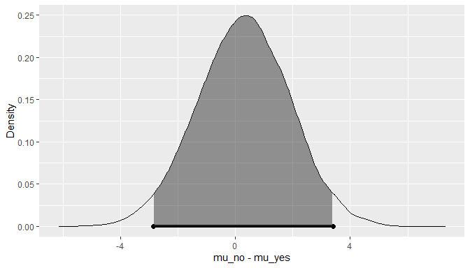
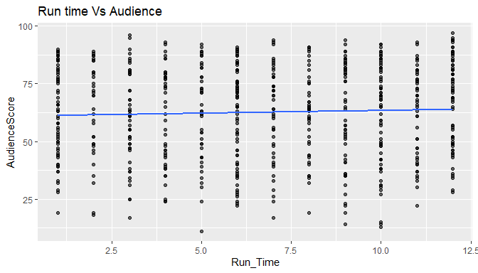

-   [Load packages](#load-packages)
-   [Load data](#load-data)
-   [Introduction](#introduction)
-   [Part 1: Data](#part-1-data)
-   [Part 2: Data manipulation](#part-2-data-manipulation)
-   [Part 3: Exploratory data analysis
    (EDA)](#part-3-exploratory-data-analysis-eda)
-   [Feature Film](#feature-film)
-   [Drama](#drama)
-   [MPAA Rating](#mpaa-rating)
-   [Oscar / Summer Season](#oscar-summer-season)
    -   [Part 4: Modeling](#part-4-modeling)
    -   [Part 5: Prediction](#part-5-prediction)
    -   [Part 6: Conclusion](#part-6-conclusion)

### Load packages

``` r
library(ggplot2)
library(statsr)
library(BAS)
library(gridExtra)
library(reshape2)
library(PairedData)
library(tidyverse)
library(dplyr)
library(broom)
```

### Load data

``` r
load("movies.Rdata")
```

Introduction
------------

This is a Data Analysis Project of the Bayesian Statistics course by
Duke University (Coursera) The purpose of this project to learn what
attributes make a movie popular. In this project Bayesian regression
model will be developed to predict audience\_score from the following
explanatory variables.

<table>
<colgroup>
<col style="width: 13%" />
<col style="width: 86%" />
</colgroup>
<thead>
<tr class="header">
<th>Variable</th>
<th>Description</th>
</tr>
</thead>
<tbody>
<tr class="odd">
<td>genre:</td>
<td>Genre of movie (Action &amp; Adventure, Comedy, Documentary, Drama, Horror, Mystery &amp; Suspense, Other)</td>
</tr>
<tr class="even">
<td>title</td>
<td>Title of movie</td>
</tr>
<tr class="odd">
<td>title_type</td>
<td>Type of movie (Documentary, Feature Film, TV Movie)</td>
</tr>
<tr class="even">
<td>genre</td>
<td>Genre of movie (Action &amp; Adventure, Comedy, Documentary, Drama, Horror, Mystery &amp; Suspense, Other)</td>
</tr>
<tr class="odd">
<td>runtime</td>
<td>Runtime of movie (in minutes)</td>
</tr>
<tr class="even">
<td>mpaa_rating</td>
<td>MPAA rating of the movie (G, PG, PG-13, R, Unrated)</td>
</tr>
<tr class="odd">
<td>studio</td>
<td>Studio that produced the movie</td>
</tr>
<tr class="even">
<td>thtr_rel_year</td>
<td>Year the movie is released in theaters</td>
</tr>
<tr class="odd">
<td>thtr_rel_month</td>
<td>Month the movie is released in theaters</td>
</tr>
<tr class="even">
<td>thtr_rel_day</td>
<td>Day of the month the movie is released in theaters</td>
</tr>
<tr class="odd">
<td>dvd_rel_year</td>
<td>Year the movie is released on DVD</td>
</tr>
<tr class="even">
<td>dvd_rel_month</td>
<td>Month the movie is released on DVD</td>
</tr>
<tr class="odd">
<td>dvd_rel_day</td>
<td>Day of the month the movie is released on DVD</td>
</tr>
<tr class="even">
<td>imdb_rating</td>
<td>Rating on IMDB</td>
</tr>
<tr class="odd">
<td>imdb_num_votes</td>
<td>Number of votes on IMDB</td>
</tr>
<tr class="even">
<td>critics_rating</td>
<td>Categorical variable for critics rating on Rotten Tomatoes (Certified Fresh, Fresh, Rotten)</td>
</tr>
<tr class="odd">
<td>critics_score</td>
<td>Critics score on Rotten Tomatoes</td>
</tr>
<tr class="even">
<td>audience_rating</td>
<td>Categorical variable for audience rating on Rotten Tomatoes (Spilled, Upright)</td>
</tr>
<tr class="odd">
<td>audience_score</td>
<td>Audience score on Rotten Tomatoes</td>
</tr>
<tr class="even">
<td>best_pic_nom</td>
<td>Whether or not the movie was nominated for a best picture Oscar (no, yes)</td>
</tr>
<tr class="odd">
<td>best_pic_win</td>
<td>Whether or not the movie won a best picture Oscar (no, yes)</td>
</tr>
<tr class="even">
<td>best_actor_win</td>
<td>Whether or not one of the main actors in the movie ever won an Oscar (no, yes) – note that this is not necessarily whether the actor won an Oscar for their role in the given movie</td>
</tr>
<tr class="odd">
<td>best_actress win</td>
<td>Whether or not one of the main actresses in the movie ever won an Oscar (no, yes) – not that this is not necessarily whether the actresses won an Oscar for their role in the given movie</td>
</tr>
<tr class="even">
<td>best_dir_win</td>
<td>Whether or not the director of the movie ever won an Oscar (no, yes) – not that this is not necessarily whether the director won an Oscar for the given movie</td>
</tr>
<tr class="odd">
<td>top200_box</td>
<td>Whether or not the movie is in the Top 200 Box Office list on BoxOfficeMojo (no, yes)</td>
</tr>
<tr class="even">
<td>director</td>
<td>Director of the movie</td>
</tr>
<tr class="odd">
<td>actor1</td>
<td>First main actor/actress in the abridged cast of the movie</td>
</tr>
<tr class="even">
<td>actor2</td>
<td>Second main actor/actress in the abridged cast of the movie</td>
</tr>
<tr class="odd">
<td>actor3</td>
<td>Third main actor/actress in the abridged cast of the movie</td>
</tr>
<tr class="even">
<td>actor4</td>
<td>Fourth main actor/actress in the abridged cast of the movie</td>
</tr>
<tr class="odd">
<td>actor5</td>
<td>Fifth main actor/actress in the abridged cast of the movie</td>
</tr>
<tr class="even">
<td>imdb_url</td>
<td>Link to IMDB page for the movie</td>
</tr>
<tr class="odd">
<td>rt_url</td>
<td>Link to Rotten Tomatoes page for the movie</td>
</tr>
</tbody>
</table>

------------------------------------------------------------------------

Part 1: Data
------------

The data set is comprised of 651 randomly sampled movies produced and
released before 2016. We data set has 32 variables, some of these
variables are only there for informational purposes and do not make any
sense to include in a statistical analysis.

Data Source: [Rotten Tomatoes](https://www.rottentomatoes.com/) and
[IMDB](https://www.imdb.com/) APIs.

Some of the sources possible biases include:

-   The dataset is based on audience opinion on IMDB and Rotten
    Tomatoes, having mostly US users, thus international movies excluded
    from the set.

-   As per IDBM it were created 9433 films in a period of 1970 - 2016.
    The sample size is less than 10% and may be too small to represent
    the population

As the data set is randomly samlped, we can assume the data it broadly
generalizable. This is an observational study where data is collected in
a way that does not directly interfere with how the data arise. In
general, observational studies can provide evidence of a naturally
occurring association between variables, but they cannot by themselves
show a causal connection.

------------------------------------------------------------------------

Part 2: Data manipulation
-------------------------

Firstly, I need to construct new variables, which will be used in the
project.

``` r
summary(movies)
```

    ##     title                  title_type                 genre        runtime     
    ##  Length:651         Documentary : 55   Drama             :305   Min.   : 39.0  
    ##  Class :character   Feature Film:591   Comedy            : 87   1st Qu.: 92.0  
    ##  Mode  :character   TV Movie    :  5   Action & Adventure: 65   Median :103.0  
    ##                                        Mystery & Suspense: 59   Mean   :105.8  
    ##                                        Documentary       : 52   3rd Qu.:115.8  
    ##                                        Horror            : 23   Max.   :267.0  
    ##                                        (Other)           : 60   NA's   :1      
    ##   mpaa_rating                               studio    thtr_rel_year 
    ##  G      : 19   Paramount Pictures              : 37   Min.   :1970  
    ##  NC-17  :  2   Warner Bros. Pictures           : 30   1st Qu.:1990  
    ##  PG     :118   Sony Pictures Home Entertainment: 27   Median :2000  
    ##  PG-13  :133   Universal Pictures              : 23   Mean   :1998  
    ##  R      :329   Warner Home Video               : 19   3rd Qu.:2007  
    ##  Unrated: 50   (Other)                         :507   Max.   :2014  
    ##                NA's                            :  8                 
    ##  thtr_rel_month   thtr_rel_day    dvd_rel_year  dvd_rel_month   
    ##  Min.   : 1.00   Min.   : 1.00   Min.   :1991   Min.   : 1.000  
    ##  1st Qu.: 4.00   1st Qu.: 7.00   1st Qu.:2001   1st Qu.: 3.000  
    ##  Median : 7.00   Median :15.00   Median :2004   Median : 6.000  
    ##  Mean   : 6.74   Mean   :14.42   Mean   :2004   Mean   : 6.333  
    ##  3rd Qu.:10.00   3rd Qu.:21.00   3rd Qu.:2008   3rd Qu.: 9.000  
    ##  Max.   :12.00   Max.   :31.00   Max.   :2015   Max.   :12.000  
    ##                                  NA's   :8      NA's   :8       
    ##   dvd_rel_day     imdb_rating    imdb_num_votes           critics_rating
    ##  Min.   : 1.00   Min.   :1.900   Min.   :   180   Certified Fresh:135   
    ##  1st Qu.: 7.00   1st Qu.:5.900   1st Qu.:  4546   Fresh          :209   
    ##  Median :15.00   Median :6.600   Median : 15116   Rotten         :307   
    ##  Mean   :15.01   Mean   :6.493   Mean   : 57533                         
    ##  3rd Qu.:23.00   3rd Qu.:7.300   3rd Qu.: 58301                         
    ##  Max.   :31.00   Max.   :9.000   Max.   :893008                         
    ##  NA's   :8                                                              
    ##  critics_score    audience_rating audience_score  best_pic_nom best_pic_win
    ##  Min.   :  1.00   Spilled:275     Min.   :11.00   no :629      no :644     
    ##  1st Qu.: 33.00   Upright:376     1st Qu.:46.00   yes: 22      yes:  7     
    ##  Median : 61.00                   Median :65.00                            
    ##  Mean   : 57.69                   Mean   :62.36                            
    ##  3rd Qu.: 83.00                   3rd Qu.:80.00                            
    ##  Max.   :100.00                   Max.   :97.00                            
    ##                                                                            
    ##  best_actor_win best_actress_win best_dir_win top200_box   director        
    ##  no :558        no :579          no :608      no :636    Length:651        
    ##  yes: 93        yes: 72          yes: 43      yes: 15    Class :character  
    ##                                                          Mode  :character  
    ##                                                                            
    ##                                                                            
    ##                                                                            
    ##                                                                            
    ##     actor1             actor2             actor3             actor4         
    ##  Length:651         Length:651         Length:651         Length:651        
    ##  Class :character   Class :character   Class :character   Class :character  
    ##  Mode  :character   Mode  :character   Mode  :character   Mode  :character  
    ##                                                                             
    ##                                                                             
    ##                                                                             
    ##                                                                             
    ##     actor5            imdb_url            rt_url         
    ##  Length:651         Length:651         Length:651        
    ##  Class :character   Class :character   Class :character  
    ##  Mode  :character   Mode  :character   Mode  :character  
    ##                                                          
    ##                                                          
    ##                                                          
    ## 

``` r
movies_new <- movies %>%
              filter(!is.na(runtime), !is.na(dvd_rel_year), !is.na(dvd_rel_month), !is.na(studio)) %>%
              mutate(feature_film   = ifelse(title_type == "Feature Film", "yes","no"),
                     drama          = ifelse(genre == "Drama", "yes","no"),
                     mpaa_rating_R  = ifelse(mpaa_rating == "R", "yes","no"),
                     oscar_season   = ifelse(thtr_rel_month %in% c(10, 11, 12), "yes","no"),
                     summer_season  = ifelse(thtr_rel_month %in% c(5, 6, 7, 8), "yes","no")) 
```

------------------------------------------------------------------------

Part 3: Exploratory data analysis (EDA)
---------------------------------------

We will begin EDA with the audience\_score variable since it will be the
response variable in the model.

``` r
ggplot(data = movies_new, aes(x = audience_score)) +
  geom_histogram(binwidth = 5)
```


``` r
summary(movies_new$audience_score)
```

    ##    Min. 1st Qu.  Median    Mean 3rd Qu.    Max. 
    ##   11.00   46.00   65.00   62.59   80.00   97.00

The histogram is left-skewed with the mean 65.

Let’s explore new variables to check the relationship between them and
the audience score.

``` r
dplyr::select(movies_new, audience_score, feature_film, drama, mpaa_rating_R, oscar_season, summer_season) %>%
  melt(measure.vars = 2:6) %>%
  ggplot(aes(x  = value, y = audience_score, fill = variable)) +
  geom_boxplot(fill="lightblue") +
  labs(x = "", y = "Audience Score") + 
  facet_grid(.~variable)
```


``` r
dplyr::select(movies_new, audience_score, feature_film, drama, mpaa_rating_R, oscar_season, summer_season) %>%
  melt(measure.vars = 2:6) %>%
  group_by(variable,value) %>%
  summarise(avg_audience_score = mean(audience_score), count = n()) 
```

    ## # A tibble: 10 x 4
    ## # Groups:   variable [5]
    ##    variable      value avg_audience_score count
    ##    <fct>         <chr>              <dbl> <int>
    ##  1 feature_film  no                  82.1    55
    ##  2 feature_film  yes                 60.7   579
    ##  3 drama         no                  60.0   333
    ##  4 drama         yes                 65.4   301
    ##  5 mpaa_rating_R no                  62.7   312
    ##  6 mpaa_rating_R yes                 62.4   322
    ##  7 oscar_season  no                  61.9   449
    ##  8 oscar_season  yes                 64.3   185
    ##  9 summer_season no                  62.9   431
    ## 10 summer_season yes                 61.9   203

Feature Film
============

Most of variables except Feature Film and Drama have similar average
audience score. We need to explore futher these variables.

The <b>feature\_film</b> varibale was build based on the title\_type
variable, so we will perform EDA based on this variable.

``` r
ggplot(movies, aes(x=factor(title_type), y=audience_score)) +
  geom_boxplot(fill="lightblue") +
  labs(x = "", y = "Audience Score", title = "Audience Score by Title Type")  
```


``` r
movies %>%
  group_by(title_type) %>%
  summarise(count = n(), avg_audience_score = mean(audience_score), median_audience_score = median(audience_score),
            min_audience_score = min(audience_score), max_audience_score = max(audience_score))
```

    ## # A tibble: 3 x 6
    ##   title_type count avg_audience_sc… median_audience… min_audience_sc…
    ##   <fct>      <int>            <dbl>            <dbl>            <dbl>
    ## 1 Documenta…    55             83.3               86               68
    ## 2 Feature F…   591             60.5               62               11
    ## 3 TV Movie       5             56.8               75               19
    ## # … with 1 more variable: max_audience_score <dbl>

It looks like average audience score of the Feature Films is 60.47, but
Documentary films are scored much higher (83.25). In the same time we
have only 5 TV Movies, which is not sufficient enough for the data
analysis.

Next we will conduct <i>a hypothesis test whether there is a difference
between Feature and Non-Feature films.</i>

*H*<sub>1</sub> = *H*<sub>2</sub>
*H*<sub>1</sub> ≠ *H*<sub>2</sub>

``` r
statsr::bayes_inference(y = audience_score, x = feature_film, 
                data = movies_new, statistic = "mean", 
                type = "ht",null=0, alternative = "twosided")
```

    ## Warning in if (is.na(which_method)) {: the condition has length > 1 and only the
    ## first element will be used

    ## Response variable: numerical, Explanatory variable: categorical (2 levels)
    ## n_no = 55, y_bar_no = 82.1455, s_no = 11.3601
    ## n_yes = 579, y_bar_yes = 60.734, s_yes = 19.8036
    ## (Assuming Zellner-Siow Cauchy prior on the difference of means. )
    ## (Assuming independent Jeffreys prior on the overall mean and variance. )
    ## Hypotheses:
    ## H1: mu_no  = mu_yes
    ## H2: mu_no != mu_yes
    ## 
    ## Priors: P(H1) = 0.5  P(H2) = 0.5 
    ## 
    ## Results:
    ## BF[H2:H1] = 422564181790
    ## P(H1|data) = 0 
    ## P(H2|data) = 1 
    ## 
    ## Posterior summaries for under H2:
    ## Response variable: numerical, Explanatory variable: categorical (2 levels)
    ## n_no = 55, y_bar_no = 82.1455, s_no = 11.3601
    ## n_yes = 579, y_bar_yes = 60.734, s_yes = 19.8036
    ## (Assuming Zellner-Siow Cauchy prior for difference in means)
    ## (Assuming independent Jeffrey's priors for overall mean and variance)
    ## 
    ## 
    ## Posterior Summaries
    ##                       2.5%         25%        50%        75%       97.5%
    ## overall mean    68.5839108  70.2903448  71.228218  72.120578   73.870838
    ## mu_no - mu_yes  15.6237138  19.0797445  20.890702  22.701298   26.152033
    ## sigma^2        332.0700122 356.5040276 370.103830 384.691106  413.940945
    ## effect size      0.8063572   0.9886908   1.087096   1.181917    1.371176
    ## n_0             13.2306500 165.6438801 399.740345 815.192488 2204.857794
    ## 95% Cred. Int.: (15.6237 , 26.152)


The result showing is that there is very strong evidence against H1,
which means that there is a significant difference of mean audience
score between Feature and Non-Feature films.

Drama
=====

The <b>drama</b> variable was build based on genre variable, which we
will explore below.

``` r
ggplot(movies, aes(x=factor(genre), y=audience_score)) +
  geom_boxplot(fill="lightblue") +
  labs(x = "", y = "Audience Score", title = "Audience Score by Genre") +
  theme(axis.text.x = element_text(angle = 90, vjust = 0.5, hjust=1))
```


``` r
ggplot(movies, aes(x=factor(genre))) +
  geom_bar(fill="lightblue") +
  labs(x = "", y = "Audience Score", title = "Number of films by Genre") +
  theme(axis.text.x = element_text(angle = 90, vjust = 0.5, hjust=1))
```


``` r
movies %>%
  group_by(genre) %>%
  summarise(count = n(), avg_audience_score = mean(audience_score), median_audience_score = median(audience_score))
```

    ## # A tibble: 11 x 4
    ##    genre                     count avg_audience_score median_audience_score
    ##    <fct>                     <int>              <dbl>                 <dbl>
    ##  1 Action & Adventure           65               53.8                  52  
    ##  2 Animation                     9               62.4                  65  
    ##  3 Art House & International    14               64                    65.5
    ##  4 Comedy                       87               52.5                  50  
    ##  5 Documentary                  52               82.8                  86  
    ##  6 Drama                       305               65.3                  70  
    ##  7 Horror                       23               45.8                  43  
    ##  8 Musical & Performing Arts    12               80.2                  80.5
    ##  9 Mystery & Suspense           59               55.9                  54  
    ## 10 Other                        16               66.7                  73.5
    ## 11 Science Fiction & Fantasy     9               50.9                  47

47% of the data set are Drama films with the average audience score 65.
At the same time Documentary and Musical & Performing Arts films have
average rating above 80. Action & Adventure, Comedy, Mystery & Suspense
films have audience rating far below the average. It could be expalined
by the small number of the films in particular genres in the available
data set.

Next we will conduct a hypothesis test whether there is a difference
between Drama and Non-Drama films.

*H*<sub>1</sub> = *H*<sub>2</sub>
*H*<sub>1</sub> ≠ *H*<sub>2</sub>

``` r
statsr::bayes_inference(y = audience_score, x = drama, 
                data = movies_new, statistic = "mean", 
                type = "ht",null=0, alternative = "twosided")
```

    ## Warning in if (is.na(which_method)) {: the condition has length > 1 and only the
    ## first element will be used

    ## Response variable: numerical, Explanatory variable: categorical (2 levels)
    ## n_no = 333, y_bar_no = 60.009, s_no = 21.1218
    ## n_yes = 301, y_bar_yes = 65.4485, s_yes = 18.6086
    ## (Assuming Zellner-Siow Cauchy prior on the difference of means. )
    ## (Assuming independent Jeffreys prior on the overall mean and variance. )
    ## Hypotheses:
    ## H1: mu_no  = mu_yes
    ## H2: mu_no != mu_yes
    ## 
    ## Priors: P(H1) = 0.5  P(H2) = 0.5 
    ## 
    ## Results:
    ## BF[H2:H1] = 19.8439
    ## P(H1|data) = 0.048 
    ## P(H2|data) = 0.952 
    ## 
    ## Posterior summaries for under H2:
    ## Response variable: numerical, Explanatory variable: categorical (2 levels)
    ## n_no = 333, y_bar_no = 60.009, s_no = 21.1218
    ## n_yes = 301, y_bar_yes = 65.4485, s_yes = 18.6086
    ## (Assuming Zellner-Siow Cauchy prior for difference in means)
    ## (Assuming independent Jeffrey's priors for overall mean and variance)
    ## 
    ## 
    ## Posterior Summaries
    ##                       2.5%        25%         50%          75%        97.5%
    ## overall mean    61.1915179  62.195018  62.7129966   63.2520289   64.2915169
    ## mu_no - mu_yes  -8.4054504  -6.415554  -5.3792381   -4.2889243   -2.2673035
    ## sigma^2        356.9629360 383.488456 398.6584735  413.9110288  445.8555805
    ## effect size     -0.4230773  -0.321816  -0.2694702   -0.2151141   -0.1128879
    ## n_0             31.9194215 342.120967 818.9043773 1598.3226782 4310.3239767
    ## 95% Cred. Int.: (-8.4055 , -2.2673)


The result is showing that there is strong evidence against H1, which
means that there is a significant difference of mean audience score
between Drama and Non-Drama films.

MPAA Rating
===========

Audience score distribution between <b>mpaa-ratings</b> are the same.
The hypothesis test shows a positive evidence against H2, which means
there is no significant difference of mean audience score between
mpaa-raings.

``` r
ggplot(movies_new, aes(mpaa_rating, audience_score)) + 
  geom_point(alpha = 0.6) +
  xlab("Run_Time") +
  ylab("AudienceScore") +
  ggtitle("Run time Vs Audience") + 
  stat_smooth(method = "lm", se = FALSE)
```


``` r
statsr::bayes_inference(y = audience_score, x = mpaa_rating_R, 
                data = movies_new, statistic = "mean", 
                type = "ht",null=0, alternative = "twosided")
```

    ## Warning in if (is.na(which_method)) {: the condition has length > 1 and only the
    ## first element will be used

    ## Response variable: numerical, Explanatory variable: categorical (2 levels)
    ## n_no = 312, y_bar_no = 62.7436, s_no = 20.2802
    ## n_yes = 322, y_bar_yes = 62.4441, s_yes = 20.0275
    ## (Assuming Zellner-Siow Cauchy prior on the difference of means. )
    ## (Assuming independent Jeffreys prior on the overall mean and variance. )
    ## Hypotheses:
    ## H1: mu_no  = mu_yes
    ## H2: mu_no != mu_yes
    ## 
    ## Priors: P(H1) = 0.5  P(H2) = 0.5 
    ## 
    ## Results:
    ## BF[H1:H2] = 15.6027
    ## P(H1|data) = 0.9398 
    ## P(H2|data) = 0.0602 
    ## 
    ## Posterior summaries for under H2:
    ## Response variable: numerical, Explanatory variable: categorical (2 levels)
    ## n_no = 312, y_bar_no = 62.7436, s_no = 20.2802
    ## n_yes = 322, y_bar_yes = 62.4441, s_yes = 20.0275
    ## (Assuming Zellner-Siow Cauchy prior for difference in means)
    ## (Assuming independent Jeffrey's priors for overall mean and variance)
    ## 
    ## 
    ## Posterior Summaries
    ##                       2.5%          25%          50%          75%        97.5%
    ## overall mean    61.0541975  62.06867779  62.59875464 6.313251e+01   64.1195928
    ## mu_no - mu_yes  -2.8437673  -0.76168885   0.30986550 1.380889e+00    3.3997404
    ## sigma^2        363.4194043 390.91892574 405.64146902 4.214727e+02  453.6187594
    ## effect size     -0.1408684  -0.03791354   0.01549277 6.862287e-02    0.1687127
    ## n_0             30.0433281 362.03363158 881.01093906 1.738553e+03 4708.3472843
    ## 95% Cred. Int.: (-2.8438 , 3.3997)



Oscar / Summer Season
=====================

Audience score distribution between <b>thtr\_rel\_month</b> are prety
the same. The hypothesis test conducted on <b>oscar\_season</b> and
<b>summer\_season</b> variables represent a positive evidence against
H2, which means there is no significant difference of mean audience
score between Oscar vs non Oscar ,and summer and non-summer seasons.

``` r
ggplot(movies_new, aes(thtr_rel_month, audience_score)) + 
  geom_point(alpha = 0.6) +
  xlab("Run_Time") +
  ylab("AudienceScore") +
  ggtitle("Run time Vs Audience") + 
  stat_smooth(method = "lm", se = FALSE)
```



``` r
statsr::bayes_inference(y = audience_score, x = oscar_season, 
                data = movies_new, statistic = "mean", 
                type = "ht",null=0, alternative = "twosided") 
```

    ## Warning in if (is.na(which_method)) {: the condition has length > 1 and only the
    ## first element will be used

    ## Response variable: numerical, Explanatory variable: categorical (2 levels)
    ## n_no = 449, y_bar_no = 61.9042, s_no = 20.0972
    ## n_yes = 185, y_bar_yes = 64.2595, s_yes = 20.1898
    ## (Assuming Zellner-Siow Cauchy prior on the difference of means. )
    ## (Assuming independent Jeffreys prior on the overall mean and variance. )
    ## Hypotheses:
    ## H1: mu_no  = mu_yes
    ## H2: mu_no != mu_yes
    ## 
    ## Priors: P(H1) = 0.5  P(H2) = 0.5 
    ## 
    ## Results:
    ## BF[H1:H2] = 5.9695
    ## P(H1|data) = 0.8565 
    ## P(H2|data) = 0.1435 
    ## 
    ## Posterior summaries for under H2:
    ## Response variable: numerical, Explanatory variable: categorical (2 levels)
    ## n_no = 449, y_bar_no = 61.9042, s_no = 20.0972
    ## n_yes = 185, y_bar_yes = 64.2595, s_yes = 20.1898
    ## (Assuming Zellner-Siow Cauchy prior for difference in means)
    ## (Assuming independent Jeffrey's priors for overall mean and variance)
    ## 
    ## 
    ## Posterior Summaries
    ##                       2.5%         25%         50%           75%        97.5%
    ## overall mean    61.3322889  62.4941277  63.1007037   63.69479209 6.482384e+01
    ## mu_no - mu_yes  -5.7867611  -3.5202339  -2.3285108   -1.16044514 1.051795e+00
    ## sigma^2        363.2161722 389.4734185 404.4639357  420.14205587 4.523029e+02
    ## effect size     -0.2885256  -0.1751393  -0.1155029   -0.05734795 5.195388e-02
    ## n_0             30.3727503 352.7241648 839.7265441 1722.06772511 4.708301e+03
    ## 95% Cred. Int.: (-5.7868 , 1.0518)


``` r
statsr::bayes_inference(y = audience_score, x = summer_season, 
                data = movies_new, statistic = "mean", 
                type = "ht",null=0, alternative = "twosided") 
```

    ## Warning in if (is.na(which_method)) {: the condition has length > 1 and only the
    ## first element will be used

    ## Response variable: numerical, Explanatory variable: categorical (2 levels)
    ## n_no = 431, y_bar_no = 62.9072, s_no = 20.2977
    ## n_yes = 203, y_bar_yes = 61.9212, s_yes = 19.8241
    ## (Assuming Zellner-Siow Cauchy prior on the difference of means. )
    ## (Assuming independent Jeffreys prior on the overall mean and variance. )
    ## Hypotheses:
    ## H1: mu_no  = mu_yes
    ## H2: mu_no != mu_yes
    ## 
    ## Priors: P(H1) = 0.5  P(H2) = 0.5 
    ## 
    ## Results:
    ## BF[H1:H2] = 12.596
    ## P(H1|data) = 0.9264 
    ## P(H2|data) = 0.0736 
    ## 
    ## Posterior summaries for under H2:
    ## Response variable: numerical, Explanatory variable: categorical (2 levels)
    ## n_no = 431, y_bar_no = 62.9072, s_no = 20.2977
    ## n_yes = 203, y_bar_yes = 61.9212, s_yes = 19.8241
    ## (Assuming Zellner-Siow Cauchy prior for difference in means)
    ## (Assuming independent Jeffrey's priors for overall mean and variance)
    ## 
    ## 
    ## Posterior Summaries
    ##                       2.5%           25%          50%         75%        97.5%
    ## overall mean    60.7389921  61.837522103  62.42109135   62.998584   64.0667276
    ## mu_no - mu_yes  -2.4805795  -0.182558368   0.97441178    2.113853    4.2921530
    ## sigma^2        364.1541787 390.279286628 405.76470430  421.594264  454.9552868
    ## effect size     -0.1222363  -0.009221358   0.04838071    0.104949    0.2139313
    ## n_0             32.3972575 354.524882676 878.52170363 1753.672294 4674.0060112
    ## 95% Cred. Int.: (-2.4806 , 4.2922)


Only 2 of the new constructed variables will be used for the modeling:
<b> feature\_film and drama </b>, which have significant evidence of
being influenced to the audience score.

------------------------------------------------------------------------

Part 4: Modeling
----------------

In this chapter I will conduct the modeling for the audience score.
Firstly, I select only variables I will use for the modeling:

``` r
df_model <- dplyr::select(movies_new, audience_score, feature_film, drama,
                runtime, thtr_rel_year, imdb_rating, imdb_num_votes, 
                critics_score, best_pic_nom, best_pic_win, best_actor_win, 
                best_actress_win, best_dir_win, top200_box)
```

The full liniar model have many coefficients of independent variables
are not statistically significant.

``` r
m_model_full <- lm(audience_score ~ . - audience_score, data = na.omit(df_model))

tidy(m_model_full)
```

    ## # A tibble: 14 x 5
    ##    term                    estimate   std.error statistic  p.value
    ##    <chr>                      <dbl>       <dbl>     <dbl>    <dbl>
    ##  1 (Intercept)         131.         80.6            1.63  1.04e- 1
    ##  2 feature_filmyes      -2.21        1.73          -1.27  2.04e- 1
    ##  3 dramayes              1.09        0.882          1.24  2.15e- 1
    ##  4 runtime              -0.0601      0.0242        -2.48  1.34e- 2
    ##  5 thtr_rel_year        -0.0797      0.0398        -2.00  4.59e- 2
    ##  6 imdb_rating          14.6         0.622         23.4   2.25e-87
    ##  7 imdb_num_votes        0.00000698  0.00000457     1.53  1.27e- 1
    ##  8 critics_score         0.0646      0.0224         2.88  4.11e- 3
    ##  9 best_pic_nomyes       5.01        2.62           1.91  5.65e- 2
    ## 10 best_pic_winyes      -2.95        4.63          -0.638 5.24e- 1
    ## 11 best_actor_winyes    -1.55        1.19          -1.30  1.93e- 1
    ## 12 best_actress_winyes  -2.15        1.31          -1.64  1.01e- 1
    ## 13 best_dir_winyes      -1.39        1.74          -0.801 4.23e- 1
    ## 14 top200_boxyes         1.31        2.78           0.472 6.37e- 1

As the purpose of this project is to build a predictive model, I will
use a least restricted AIC method. With AIC some non-informative
variables could be included in the model for better prediciton.

``` r
model_aic = bas.lm(audience_score ~ . -audience_score, data = df_model,  
                   prior = "AIC", modelprior = uniform())
```

    ## Warning in model.matrix.default(mt, mf, contrasts): non-list contrasts argument
    ## ignored

``` r
round(summary(model_aic),2)
```

    ##                     P(B != 0 | Y)  model 1  model 2  model 3  model 4  model 5
    ## Intercept                    1.00     1.00     1.00     1.00     1.00     1.00
    ## feature_filmyes              0.35     0.00     0.00     0.00     0.00     0.00
    ## dramayes                     0.35     0.00     0.00     0.00     0.00     0.00
    ## runtime                      0.88     1.00     1.00     1.00     1.00     1.00
    ## thtr_rel_year                0.58     1.00     0.00     1.00     0.00     1.00
    ## imdb_rating                  1.00     1.00     1.00     1.00     1.00     1.00
    ## imdb_num_votes               0.44     0.00     0.00     0.00     0.00     1.00
    ## critics_score                0.98     1.00     1.00     1.00     1.00     1.00
    ## best_pic_nomyes              0.66     1.00     1.00     1.00     1.00     1.00
    ## best_pic_winyes              0.30     0.00     0.00     0.00     0.00     0.00
    ## best_actor_winyes            0.49     0.00     0.00     1.00     1.00     0.00
    ## best_actress_winyes          0.58     1.00     1.00     1.00     1.00     1.00
    ## best_dir_winyes              0.38     0.00     0.00     0.00     0.00     0.00
    ## top200_boxyes                0.32     0.00     0.00     0.00     0.00     0.00
    ## BF                             NA     1.00     0.95     0.95     0.86     0.75
    ## PostProbs                      NA     0.01     0.01     0.01     0.01     0.01
    ## R2                             NA     0.75     0.75     0.75     0.75     0.75
    ## dim                            NA     7.00     6.00     8.00     7.00     8.00
    ## logmarg                        NA -3510.85 -3510.90 -3510.90 -3511.00 -3511.14

``` r
image(model_aic, rotate=FALSE, intensity=TRUE)
```


As you can see runtime, imdb\_rating, critics\_score, best\_pic\_nom
variables exists in most of the models.

``` r
confint(coef(model_aic))
```

    ##                              2.5%        97.5%          beta
    ## Intercept            6.181727e+01 6.339873e+01  6.259148e+01
    ## feature_filmyes     -3.813327e+00 1.111386e+00 -4.843457e-01
    ## dramayes            -6.515149e-01 1.959192e+00  2.477888e-01
    ## runtime             -9.752602e-02 0.000000e+00 -5.122110e-02
    ## thtr_rel_year       -1.265918e-01 8.780758e-03 -3.642520e-02
    ## imdb_rating          1.349389e+01 1.602653e+01  1.481328e+01
    ## imdb_num_votes      -1.765172e-06 1.257785e-05  2.315135e-06
    ## critics_score        2.319637e-02 1.183411e-01  6.910036e-02
    ## best_pic_nomyes     -8.291825e-03 8.783944e+00  2.964050e+00
    ## best_pic_winyes     -7.997412e+00 4.627846e+00 -5.002806e-01
    ## best_actor_winyes   -3.560854e+00 2.642208e-01 -8.154126e-01
    ## best_actress_winyes -4.377473e+00 2.620998e-01 -1.216290e+00
    ## best_dir_winyes     -4.292507e+00 8.641362e-01 -6.180697e-01
    ## top200_boxyes       -1.947484e+00 5.808679e+00  5.795125e-01
    ## attr(,"Probability")
    ## [1] 0.95
    ## attr(,"class")
    ## [1] "confint.bas"

``` r
coef(model_aic)
```

    ## 
    ##  Marginal Posterior Summaries of Coefficients: 
    ## 
    ##  Using  BMA 
    ## 
    ##  Based on the top  8192 models 
    ##                      post mean   post SD     post p(B != 0)
    ## Intercept             6.259e+01   3.994e-01   1.000e+00    
    ## feature_filmyes      -4.843e-01   1.213e+00   3.484e-01    
    ## dramayes              2.478e-01   6.166e-01   3.464e-01    
    ## runtime              -5.122e-02   2.929e-02   8.819e-01    
    ## thtr_rel_year        -3.643e-02   4.313e-02   5.798e-01    
    ## imdb_rating           1.481e+01   6.376e-01   1.000e+00    
    ## imdb_num_votes        2.315e-06   3.951e-06   4.415e-01    
    ## critics_score         6.910e-02   2.398e-02   9.821e-01    
    ## best_pic_nomyes       2.964e+00   2.930e+00   6.622e-01    
    ## best_pic_winyes      -5.003e-01   2.688e+00   2.993e-01    
    ## best_actor_winyes    -8.154e-01   1.181e+00   4.935e-01    
    ## best_actress_winyes  -1.216e+00   1.446e+00   5.764e-01    
    ## best_dir_winyes      -6.181e-01   1.313e+00   3.751e-01    
    ## top200_boxyes         5.795e-01   1.771e+00   3.188e-01

``` r
plot(model_aic, ask=F)
```


According to diagnostic there are a few outliers at rows 124, 246, and
212. Additionally the residual plot doesn’t look quite random. There are
many positive residuals for the lower predicted scores. Hence movies
with low scores aren’t quite as low as we are predicting.

The model completity appears to peak around the 5 to 9 mark which makes
sense given that we have 6 variables in our model.

------------------------------------------------------------------------

Part 5: Prediction
------------------

Let’s find predictive values under the best predictive model, the one
that has predictions closest to BMA and corresponding posterior standard
deviations.

To test a model I chose 3 films.

<b>Arrival</b>

<a href="https://www.imdb.com/title/tt2543164/" class="uri">https://www.imdb.com/title/tt2543164/</a>

<a href="https://www.rottentomatoes.com/m/arrival_2016" class="uri">https://www.rottentomatoes.com/m/arrival_2016</a>

``` r
movie_p <- data.frame(runtime = 116, 
                      thtr_rel_year = 2016,
                      feature_film = 'yes', 
                      drama = 'yes', 
                      imdb_rating = 7.9,
                      critics_score = 94, 
                      imdb_num_votes = 488604,
                      best_pic_win = 'no',
                      best_pic_nom = 'no',
                      best_actor_win = 'no', 
                      best_actress_win = 'no',
                      best_dir_win = 'no',
                      top200_box = 'no')

prediction_Revenant <- predict(model_aic, newdata=movie_p, estimator="BPM")
prediction_Revenant$Ybma
```

    ##          [,1]
    ## [1,] 85.80941

The predicted audience score 85.8 is fairly close to the actual rating
82.

<b> La La Land </b>

<a href="https://www.imdb.com/title/tt3783958/" class="uri">https://www.imdb.com/title/tt3783958/</a>

<a href="https://www.rottentomatoes.com/m/la_la_land" class="uri">https://www.rottentomatoes.com/m/la_la_land</a>

``` r
movie_p <- data.frame(runtime = 128, 
                      thtr_rel_year = 2016,
                      feature_film = 'yes', 
                      drama = 'yes', 
                      imdb_rating = 8,
                      critics_score = 81, 
                      imdb_num_votes = 412821,
                      best_pic_win = 'no',
                      best_pic_nom = 'yes',
                      best_actor_win = 'no', 
                      best_actress_win = 'yes',
                      best_dir_win = 'yes',
                      top200_box = 'no')

prediction_Revenant <- predict(model_aic, newdata=movie_p, estimator="BPM")
prediction_Revenant$Ybma
```

    ##          [,1]
    ## [1,] 86.73202

The predicted audience score 86.7 is fairly close to the actual rating
81.

<b>Norm of the North </b>

<a href="https://www.imdb.com/title/tt1594972/?ref_=ttls_li_tt" class="uri">https://www.imdb.com/title/tt1594972/?ref_=ttls_li_tt</a>

<a href="https://www.rottentomatoes.com/m/norm_of_the_north" class="uri">https://www.rottentomatoes.com/m/norm_of_the_north</a>

``` r
movie_p <- data.frame(runtime = 90, 
                      thtr_rel_year = 2016,
                      feature_film = 'yes', 
                      drama = 'yes', 
                      imdb_rating = 3.6,
                      critics_score = 9, 
                      imdb_num_votes = 7743,
                      best_pic_win = 'no',
                      best_pic_nom = 'no',
                      best_actor_win = 'no', 
                      best_actress_win = 'no',
                      best_dir_win = 'no',
                      top200_box = 'no')

prediction_Revenant <- predict(model_aic, newdata=movie_p, estimator="BPM")
prediction_Revenant$Ybma
```

    ##          [,1]
    ## [1,] 16.45726

The predicted audience score 16.5 is fairly close to the actual rating
22.

------------------------------------------------------------------------

Part 6: Conclusion
------------------

The predictive model satisfies the expectation even though the
diagnostics were not very good. Some limitations of this work consisted
on the very small sample population.

At the same time, predicting of Rotten Tomatoes audience score based on
IMDB Rating seems quite useless due to the fact that the same audience
evaluate films on both web-sites. However, I gained good knowledge of
Bayesian statiscs while doing the project.
